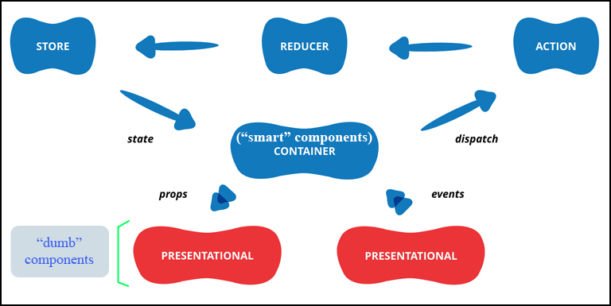

# Planning Activities: React/Redux and SASS

## Aim
> * The main goal of this project is to practice **React** with **Redux** and **SASS**. There will be no **database** or **backend**, just making request to **APIs**
> * There will be 2 main parts
>     - "Internal": activities from the application (measurement of **Body Mass Index**). 
>     - "External": requests to **APIs** (**Library of Congress**).
> * These three parts are completely independent between them. We could create **button**, **link**, **tab**, etc. to select one of them very easily ...
> * Reusable **Modal**" which works all the time (not depending on "**z-index**").

### This project respect totally the following architecture of React/Redux: 



## Modal
### Advantages

> * Utilization extremely easy and we are cleaning up the DOM after usage.
> * Absolutely not depending on the "**z-index**" of the application.
> * Just 2 files ("**modaljs**" and "**modalStyle.scss**" which could be put together very easily. But for future features, it's better to let them separately) to copy to a new project. The "close" button need to be configured. For example, after displaying data, we want to reset data of the form, etc.
> * To add to an existing component, we need just to wrap the code of the "**return**" inside "**<Modal>**" like:


```
 import Modal from 'where_I_put_the_Modal' // maybe inside the "components": '../modal/modal'

 ...
 return(
   <Modal>
     // existing content of the component
   </Modal>
 )
```

## Inconvenient

> * Could not click outside to close the "modal".

## User Interfaces

### * Main UI


---

### * Calculation of Body Mass Index: training with **form**


On "Submit", we have (utilization of our customized **modal**):


---

### * Search Free Articles from Library of Congress:  more training with **form**  + interaction with **APIs**.


On "Submit", we have (utilization of our customized **modal**):


---

## Author
* Dinh HUYNH - All Rights Reserved!
* dinh.hu19@yahoo.com